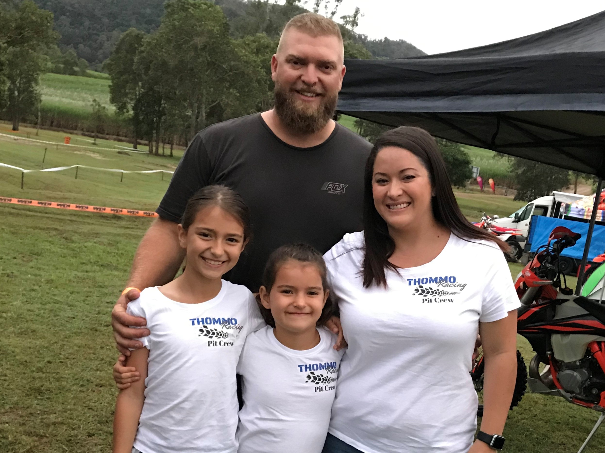

### My Profile

<b>Name:</b> Ashleigh Thompson

<b>Student No.:</b> s3688994

<b>Email Address:</b> s3688994@student.rmit.edu.au

Hi! My name is Ashleigh and I am a 32 year old university student studying a Bachelor of Business (Financial Planning) to become a Financial Adviser.

I currently work full time as a Paraplanner at a local Financial Planning firm.  This involves preparing and writing Statement of Advice documents amongst other things.  I have been in this job for 3 years and it’s the best job I’ve had so far (and I’ve had a few different jobs in real estate and bookkeeping).  I’ve finally found a career I’m passionate about.

I am married to an amazing husband and have 2 beautiful daughters, Sienna (10) and Chloe (7).  We live in a small town in tropical North Queensland, called Mackay.  I’ve lived here my entire life.  Some people know Mackay as it’s typically referred to as the gateway to the Whitsundays and Great Barrier Reef.  Cruising the Whitsundays is a definite must-do if you’re visiting the area!

We have an interesting household of our family of 4, plus 2 dogs (a Mini Dachshund and a Cane Corso Italian Mastiff), a Wheatbelt Stimson python and a goldfish.  Our weekends are generally filled with beach and camping trips, attending the kids sport (netball and gymnastics) and meeting up with friends and family.  I wish I could say I had a hobby or favourite pastime but who has time for that between all of this!!

### Interest in IT

My initial interest in computers and IT began when I was about 10 or so years old.  My parents owned a small computer store where they sold custom built computers and did repairs.  Because of this, I spent a lot of time in the shop on the computer playing games.  Back then, not a lot of people had or could even afford computers.  I was lucky enough to have heaps of access to them and it helped me develop some computer skills very early in life in regards to Microsoft Office, Explorer and simple troubleshooting issues.  This helped me when it came to my IT subjects in high school and later on in my real estate and bookkeeping jobs.

I came to RMIT as they offered a Bachelor of Business (Financial Planning) via Open Universities.  In Mackay, we have only one university nearby which does not offer this degree.  As this degree is a requirement to become a Financial Adviser, this was a good option as opposed to moving towns!

Currently, my experience is pretty limited in the wide world that is IT.  I expect to learn how IT is moulding the lives we currently live in and the ways in which it will be incorporated in our lives in the future.  I hope to learn more about how we can use IT to assist in business.

### Ideal Job

<a href="https://www.seek.com.au/job/39188139?searchrequesttoken=b470d624-2697-40c4-b6e7-17930e74d0a2&type=standard">My Ideal Job - Advertisement</a>

After I have completed the Bachelor of Business (Financial Planning), I aim to become a Financial Adviser.  If I were to be looking for a job at that time, I’d be looking at a role as per this job advertisement.  I would be looking for a financial adviser role in an established office that is well known and respected in this area of expertise.  What appeals to me most is the mention of compliance.  This is of upmost importance when it comes to this type of career.  

There has recently been changes to the education requirements of financial advisers.  You will note that one of the requirements of this position is a “relevant industry degree qualification”.  Specifically, this is the Bachelor of Business (Financial Planning) obtained through an approved provider.  Also required is experience in providing advice to clients, technical knowledge which would incorporate strategy creation for clients, the ability to effectively communicate with clients (and potentially all others in the organisation) and the ability to build rapport. 

Although I am only part way through my degree, I hope to have to opportunity to have a higher level of client interactions by the time I’ve completed my degree.  I would then need to complete a “professional year” which would include providing advice in the areas I’m registered to provide advice in, meet with clients and build a client base.  Unfortunately, most of these requirements are unable to be obtained until my degree is complete.

### Personal Profile

Myers Briggs Results via 16Personalities.com:

Learning Style Results via EducationPlanner.org:

Big 5 Personality Test Results via Truity:

The results of these tests told me a lot of things I already know about myself, for example, that I am a good organiser, that I am a social person that generally needs appreciation from other people.  I am a caring person that is empathetic to others and I love to help.  However, I do feel like they outlined some areas that I need improvement on.  In a team environment, I need to be able to take on and respect others’ ideas and contributions.  Just because I think something should be done a particular way, doesn’t make it right.  When forming and working within a team, I need to keep this in mind.  I will endeavour to be open-minded and respect their ideas.

### Project Idea

<b>Pet Tracking Microchip</b>

<ins>Overview</ins>

In November 2018, my dog escaped from our grandparents’ house while we were away on holidays.  Unfortunately in the process of digging under the fence, he managed to pull his collar off.  After a few reported sightings from the community and many, many hours of searching for him, we never found him.  The one thing that I kept thinking about at that time was “if only his microchip had a GPS (Global Positioning System) tracker that would allow us to track him via an App on our phone just like Find My iPhone”.  This is what has led me to the idea of a physical microchip and device application for the purpose of tracking animals.

<ins>Motivation</ins>

The RSPCA reports that Australia is one of the largest pet ownership countries in the world, with about 62% of Australians owning pets.  Currently there is estimated to be approximately 24 million pets owned in Australia.  In 2017/18, the RSPCA reported to have received 93,297 dogs and cats through their facilities as a result of surrender or lost pets and this does not account for the thousands of pets that likely go missing or are stolen and never found. (RSPCA, 2019)

Although trackers are currently available for animals in the form of collars, a solution is not yet available for animals that are not wearing collars at the time they go missing.  A device that’s able to be permanently attached to the pet that’s difficult to remove will be incredible useful for pet owners to track their animals, even if it is just for body retrieval.  

<ins>Description</ins>

The system would need to be created in 2 parts.  The first being a microchip type device that could be implanted under the skin just like the typical scannable microchip currently available for animals.  The second would be an application that’s downloadable on a device such as a mobile phone and computer.

The microchip would need to be very small in size, easy to insert and relatively pain free for the animal.  If it can be incorporate with the scannable microchip available now, that would be even better.  The chip would need to be able to let off signals or pings that’s able to be tracked via the application by the pet owner.

The pet owner would be able to access a specific application that’s secured specifically to their animals.  They could even access an account that could holds specific information about each of their pets.  This may include the owner’s contact details which can be easily updated by them at any time as well as microchip information and GPS data.

If the animal is lost and found by a passer by, the animal can still be taken to a local vet and scanned for the chip which would give you all of the owner information, as it is now.  However, if the owner becomes aware of the pet missing before anyone finds it, they can locate the pet via the application.   There could even be the capability of creating a proximity alarm where the owner is sent an alert if the pet breaches the perimeter of say, the yard of the property or moves a certain distance away from set GPS coordinates (set to the home location, say).

This would save the owner time as well as the resources of the RSPCA or local councils that are required to pick up animals and tracking their owners.  It would also assist in finding the animals if they are stolen. 

Unfortunately, this type of system is likely to be costly which would deter some pet owners.  So although it would reduce the number of lost animals that end up in pounds, RSPCA or even pass away, it would not be a complete solution.  However, I believe there’s definitely a market for this type of system. 

<ins>Tools and Technologies</ins>

Currently pet microchips are made from bioglass that are about the size of a grain of rice, that encapsulates a radio-frequency transponder.  The size and shape make it easy to be inserted under the skin, generally by a veterinarian.  To ensure this process is not affected, the GPS component of the chip would need to be incredible small.

The problem with this idea is that generally GPS requires a battery source to function.  To have this chip run permanently, the GPS would need to be designed without the need of a battery or alternatively another signal-releasing technology would need to be created to allow the device to be functional in this way.

The application would be the easy part really, as it would require something similar to a Find My iPhone functionality but with data input allowances.  The application would need to be available for both iOS, Android and Microsoft.

<ins>Skills Required</ins>

There would need to be a few different areas of expertise involved in this project including scientists to develop a way of incorporating a rechargeable power source that will not affect the wellbeing of the animal and IT experts to create an application that will be compatible with the new technology.

If new technology and the power source is a large issue, the project will not be feasible as the costs would become astronomical.  However, these days, this type of technology may already be in the process of being created!

<ins>Outcome</ins>

If the project is successful, pet owners will be able to find their pets no matter whether they are alive, passed away or stolen.  Less time will be wasted searching, visiting vets and putting up flyers! There will also be less pets in the pound and with RSPCA which will reduce the load on these services.  I know I would purchase this system for my current pets so as never to go through the loss of a pet again!

<ins>Reference List</ins>

16Personalities, 2019, <i>Free Personality Test</i>, NERIS Analytics Limited, viewed 9 June 2019, https://www.16personalities.com/free-personality-test

Education Planner, 2019, <i>What's Your Learning Style? 20 Questions</i>, Pennsylvania Higher Education Assistance Agency (PHEAA), viewed 9 June 2019, http://www.educationplanner.org/students/self-assessments/learning-styles-quiz.shtml

PetFinder, 2019, <i>How do Pet Microchips Work?</i>, Petfinder, viewed 9 June 2019, https://www.petfinder.com/dogs/lost-and-found-dogs/how-pet-microchips-work/

RSPCA, 2019, <i>Annual Statistics 2017-2018</i>, RSPCA, viewed 9 June 2019, https://www.rspca.org.au/facts/annual-statistics-2017-18

RSPCA, 2019, <i>How many pets are there in Australia?</i>, RSPCA Knowledgebase, viewed 9 June 2019, https://kb.rspca.org.au/knowledge-base/how-many-pets-are-there-in-australia/

Seek Limited, 2019, <i>Financial Planner</i>, Seek Limited, viewed 9 June 2019, https://www.seek.com.au/job/39188139?searchrequesttoken=b470d624-2697-40c4-b6e7-17930e74d0a2&type=standard

Truity, 2019, <i>The Big Five Personality Test</i>, Truity, viewed 9 June 2019, https://www.truity.com/test/big-five-personality-test
